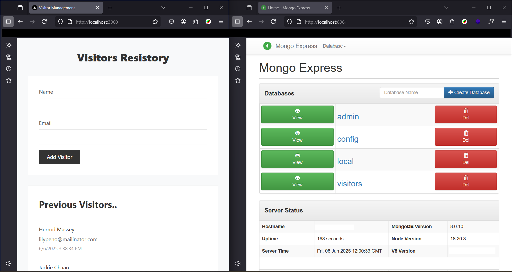

# (Express + MongoDB) Dockerized Project

This project demonstrates how to containerize a Node.js Express application with MongoDB using Docker and Docker Compose. Below is a guideline to the Docker concepts and steps implemented in this project.

---



## Docker Concepts Used

### 1. **Docker Images**

- The Express app uses a custom image built from the provided `Dockerfile`.
- MongoDB and Mongo Express use official images pulled from Docker Hub.

### 2. **Docker Containers**

- Each service (Express app, MongoDB, Mongo Express) runs in its own isolated container.

### 3. **Dockerfile**

```Dockerfile
FROM node:22.16-alpine
WORKDIR /usr/express-mongo
COPY package*.json .
RUN npm install
COPY . .
EXPOSE 3000
ENTRYPOINT ["npm", "run", "dev"]
```

1. Use the official Node.js base image.
2. Set the working directory.
3. Copy dependencies and install them.
4. Copy the application code.
5. Expose the application port.
6. Set the default command to run the app.

### 4. **Docker Compose Configuration**

```yaml
services:
  express-app:
    build: .
    ports:
      - 3000:${PORT}
    environment:
      PORT: 3000
      MONGODB_URI: ${MONGODB_URI}
    volumes:
      - ./src:/usr/express-mongo/src/

  mongo:
    image: mongo
    environment:
      MONGO_INITDB_ROOT_USERNAME: ${MONGO_INITDB_ROOT_USERNAME}
      MONGO_INITDB_ROOT_PASSWORD: ${MONGO_INITDB_ROOT_PASSWORD}
    volumes:
      - mongo_data:/data/db

  mongo-express:
    image: mongo-express
    environment:
      ME_CONFIG_MONGODB_ADMINUSERNAME: ${ME_CONFIG_MONGODB_ADMINUSERNAME}
      ME_CONFIG_MONGODB_ADMINPASSWORD: ${ME_CONFIG_MONGODB_ADMINPASSWORD}
      ME_CONFIG_MONGODB_URL: ${ME_CONFIG_MONGODB_URL}
    ports:
      - 8081:8081
    depends_on:
      - mongo

volumes:
  mongo_data:
```

1. **Express App** - Builds from Dockerfile, uses `.env` variables, mounts `./src` for live development
2. **MongoDB** - Official image with persistent storage via `mongo_data` volume
3. **Mongo Express** - Web UI at port 8081, depends on MongoDB service
4. **Environment Variables** - All credentials loaded from `.env` file
5. **Live Development** - Source code changes reflect instantly in container

## Step-by-Step Usage

### 1. **Clone the Repository**

```sh
git clone https://github.com/jsmikat/docker-concepts.git
cd docker-concepts
```

### 2. **Configure Environment Variables**

- Copy `.env.sample` to `.env` and fill in your credentials:

```sh
cp .env.sample .env
```

### 3. **Build and Run with Docker Compose**

- Build and start all services:

```sh
docker compose up -d
```

- To stop the services:

```sh
docker compose down
```

### 4. **Access the Application**

- **Express API:** [http://localhost:3000](http://localhost:3000)
- **Mongo Express UI:** [http://localhost:8081](http://localhost:8081)

---

## Summary

This project demonstrates:

- Building custom images with Dockerfile
- Using official images from Docker Hub
- Managing multi-container applications with Docker Compose
- Persisting data with Docker volumes
- Secure configuration with environment variables